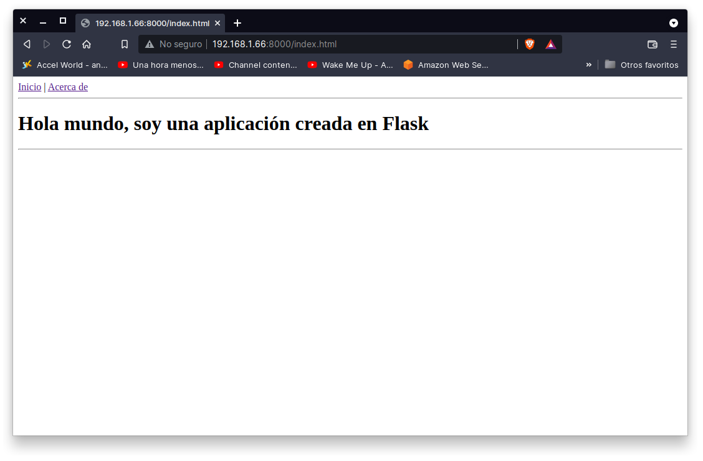
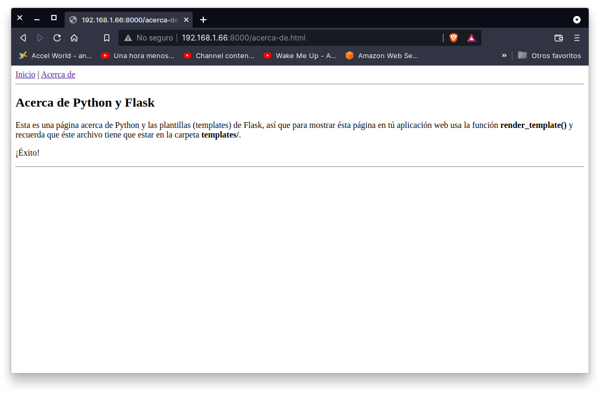

## Introduccióm a Flask

### OBJETIVO

- Crear una lplicación web utizando Flask
- Mostrar páginas de la aplicación por medio de plantillas (templates)

#### REQUISITOS

1. Python 3
2. Flask instalado

#### DESARROLLO

Flask es un framework minimalista escrito en Python que permite crear aplicaciones web rápidamente y con un mínimo número de líneas de código. 

Para utilizar flask es necesario instalarlo e importarlo, no está disponible desde la libreria estandar, pero si desde pip

```
pip installl flask
```

Vamos a crear una aplicación web que consiste en dos página, la página de **Inicio** y la página de **Acerca de** como se muestra a continuación.





Se puede ver las páginas ya maketadas desde la carpeta `public_html/` el diseñador y maketador ya hicieron su chamba.

Nota que para navegar entre una u otra página se hace uso de una URL, mejor aún abre una Terminal (Anaconda Prompt en windows) y cambiate a la carpeta `public_html` del `Ejemplo-01` de la `Sesion-07`, ahora ejecuta el siguiente comando:

```
(base) Sesion-07/Ejemplo-01 $ python -m http.server
Serving HTTP on 0.0.0.0 port 8000 (http://0.0.0.0:8000/) ...
```

Ésto inicia un mini servidor web y podrás acceder a la página web como si de un servidor real se tratara, abre en tu navegador la dirección `http://localhost:8000` y observa el resultado.

Ahora observa que para cambiar entre una página y otra tenemos dos URL's

- URL para la página de inicio: `http://localhost:8000/`
- URL para la página de acerca de: `http://localhost:8000/acerca-de.html`

Nota que para la página de inicio también se puede acceder por medio de la URL `http://192.168.1.66:8000/index.html`, esto significa que toda página web cuanta con una página principal, inicio, home o raíz y en el área de páginas web se conoce como **diagonal** o index.html o index.php o index.pl o etc.

Cuando hablamos de aplicaciones web, éstas URL's dejan de indicar directamente archivos y sólo se vuelven etiquetas para nombrar a cada una de las páginas de nuestra aplicación web iniciando por la página principal o página raíz:

```
/          <- página principa, raíz, inicio o home
/acerca-de <- página con el contenido de acerca de
/contacto  <- página con la información de contacto
/productos <- página con la lista de productos
...
```
En el área de desarrollo de aplicaciones web a estar direcciones o links o URL's ser les conoce como **rutas** y toca a nosotros definirlas.

En una aplicación web una ruta ya no se asocia directamente con un archivo html, en su lugar se asocia con una función normalmente llamada similarmente al nombre de la ruta, por ejemplo:

```
/          <- inicio()
/acerca-de <- acerca_de() 
/contacto  <- contacto() 
/productos <- productos() 
...
```

Cada una de estas funciones será la encargada de generar el código HTML para la ruta o página indicada por la ruta o URL y para ello en Flask se aplica un decorador @app.route(ruta) a cada función.

El siguiente código muestra como crear una página que imprime "Hola Mundo", debido a que index se encuentra decorado con '/', la entrada será directa


Crea el script `hola-flask.py` con el siguiente código:
```
from flask import Flask

app = Flask(__name__)

def index():
    return "¡Hola mundo!"

if __name__ == "__main__":
    app.run(debug=True)
```

Y ejecutamos est programa muestra en la terminal:

```
(base) Sesion-07/Ejemplo-01 $ python hola-flask.py
 * Serving Flask app "hola-flask" (lazy loading)
 * Environment: production
   WARNING: This is a development server. Do not use it in a production deployment.
   Use a production WSGI server instead.
 * Debug mode: on
 * Running on http://127.0.0.1:5000/ (Press CTRL+C to quit)
 * Restarting with stat
 * Debugger is active!
 * Debugger PIN: 291-567-355
```

En el cual nos indica que para ver la página en ejecución debemos ir a: http://127.0.0.1:5000/  en un navegador.

Si en lugar de ver sólo un texto simple queremos ver una página entonces abre el contenido del archivo `public_html/index.html` y pégalo como resultado de la función `index()` y observa el resultado.


