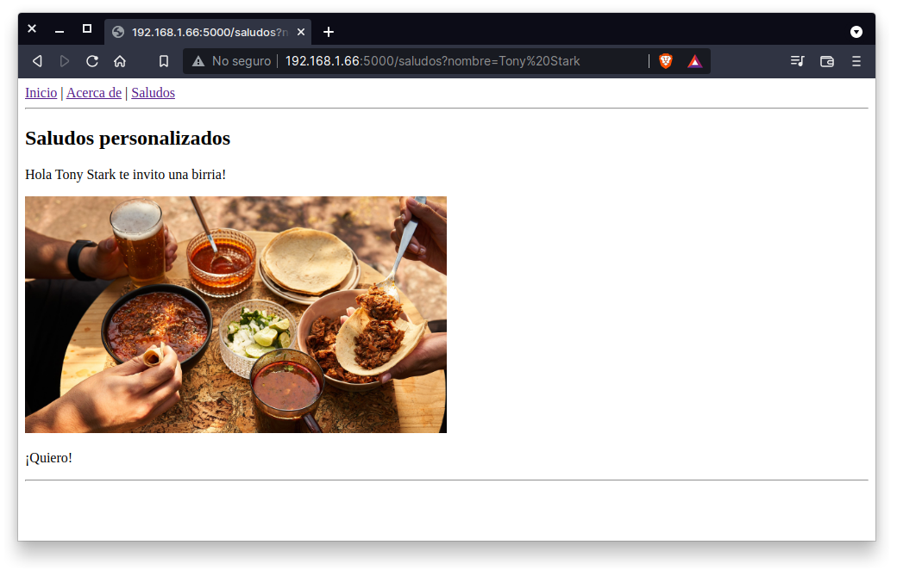

## Rutas, plantillas y parámetros GET

### OBJETIVO

- Crear páginas con formularios usando Flask

#### REQUISITOS

1. Python 3
2. Flask

#### DESARROLLO

Además de tener múltiples rutas es posible crear páginas que acepten argumentos por medio de la URL, para esto podemos utilizar el método `request`, recuerda importarlo desde el módulo `flask`.

Entonces vamos a agregar una nueva página a nuestra webapp llamada **Saludos** con los siguientes elementos:

1. Ruta: `/saludos`
2. Función: `saludos()`
3. Plantilla: `saludos.html`

Y la página tiene que imprimir en el navegador unos saludos dependiendo del valor de la variable `nombre` parada en la dirección url, por ejemplo:

- url: http://127.0.0.1:5000/saludos, imprime: ¡Hola Humano, te invito una birria!
- url: http://127.0.0.1:5000/saludos?nombre=rctorr, imprime: ¡Hola Rctorr, te invito una birria!
- url: http://127.0.0.1:5000/saludos?nombre=Tony, imprime: ¡Hola Tony, te invito una birria!



El código sería como el siguiente:

```
@app.route('/saludos')
def saludos():
    nombre_get = request.args.get('nombre', 'Humano')
    return render_template("saludos.html", nombre=nombre_get)
```

Ahora también hay que copiar el archivo `public_html/saludos.html` a `templates/saludos.html`, modificar las direcciones de las etiquetas `<a href="...">` y además vamos a hacer uso de Jinja 2 que es un motor de plantillas para Python (y el que usa Django), lo que permite al desarrollador hacer frontend o crear código HTML de forma programática.

Jinja nos permite usar bloques para usar código Seudo-Python de la siguiente forma:

```



```

O para acceder al contenido de variables se usa la forma corta: `{{ variable }}` muy similar a lo usados en las f-string, de tal forma que las llaves y el nombre de la variable serán remplazadas por el valor de la variable.

Entonces modificamos el archivo `templates/saludos.html` para incluir el valor de la variable `nombre` que es pasada por la función `render_template()` a la plantilla.

```
    <h2>Saludos personalizados</h2>
    <p>Hola {{ nombre }} te invito una birria!</p>
```

Ahora si modifica la url como se mencionó antes y observa los resultados.

Esto es código HTML generado dinámicamente como resultado de un valor proporcionado por el usuario.

