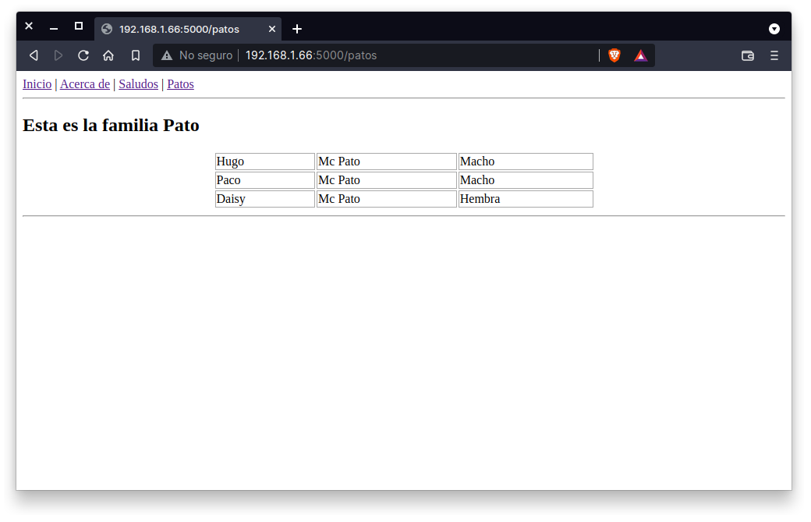

## Página con lista de patos

### OBJETIVO 

- Utilizar rutas con argumentos validados

#### REQUISITOS 

1. Python 3
2. Flask

#### DESARROLLO

Modifica la webapp `hola-flask.py` y agrega una página más para que imprima la lista de los mientros de la familia **Patos** contenida en el archivo `patos.csv`, la página se tiene que acceder usando la ruta `http://localhost:5000/patos`.

Recuerda definir tus 3 elementos base para toda página y en ésta ocasión la función deberá de leer el contenido del archivo csv y pasarlo a la plantilla como una variable, que podría llamarse `patos` y que sería una lista de filas.

En la plantilla tendrás a tu disposición ésta misma variable (si la has pasado correctamente) y puede hacer uso de un ciclo for de la siguiente manerapara crear una tabla en HTML de forma automatizada:

```
<table>

    <tr><td>{{ fila.0 }}</td><td>{{ fila.1 }}</td><td>{{ fila.2 }}</td></tr>

</table>
```

El resultado a obtener es similar al siguiente:


